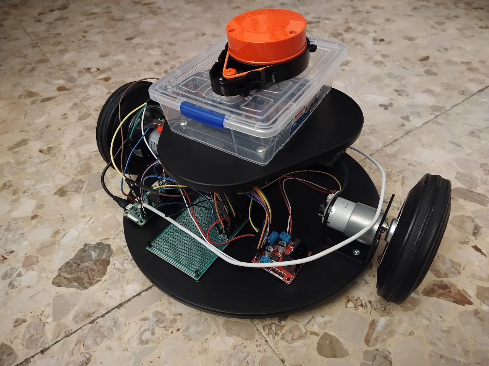

# ROBOT SLAM

A step-by-step guide on building a **differential drive robot** capable of performing **SLAM (Simultaneous Localization and Mapping)** using **ROS2** and a **Raspberry Pi Zero 2W**.



---

## 📚 Table of Contents
- [Project Description](#🧠-project-description) 
- [Hardware](#⚙️-hardware) 
  > [Microcontroller](#microcontroller) 

  > [Sensors and Actuators](#sensors-and-actuators) 
    - [DC Motors](#dc-motors)
    - [Lidar](#lidar) 
  > [Motor Driver](#motor-driver) 

  > [Others](#others) 
- [Software](#💻-software) 
  > [Operating System](#operating-system) 

  > [ROS](#ros) 
  
  > [Code and Architecture](#code-and-architecture) 
- [Conclusions](#🧩-conclusions) 
- [Errors and Warnings](#⚠️-errors-and-warnings) 
- [WSL Options](#🪟-wsl-options) 
---


## 🧠 Project Description

This project details the design and setup of a **differential drive robot** capable of performing **Simultaneous Localization and Mapping (SLAM)**.  
The robot operates on a flat plane (no movement along the Z-axis) and can be remotely controlled using **ROS 2** commands.

Because the onboard hardware has limited computational power, SLAM is not performed locally. Instead, the robot transmits all sensor data via **ROS topics** to a Linux machine that performs the heavy computations for mapping and localization.

---

## ⚙️ Hardware

### Components Used
```bash
- Raspberry Pi Zero 2W (Ubuntu 24.04 LTS)
- 2x 12V DC Motors with Encoders (37 RPM)
- 1x Lidar (LDS02RR)
- 1x Motor Driver (L298N)
- 1x Logic Level Shifter
- 2x Wheels (~6 cm radius)
- 2x Power Supply (12V Li-ion or LiPo | 5V battery bank)
```

---

### Microcontroller
The main controller is a **Raspberry Pi Zero 2W**, running **Ubuntu 24.04 LTS (ARM64)**.  
It handles:
- Sensor data acquisition  
- Motor control via GPIO  
- Communication with ROS2 topics  

The Raspberry Pi connects to the remote Linux system over **Wi-Fi**, enabling distributed computation for SLAM.

---

### Sensors and Actuators

#### DC Motors
Two **12V DC motors** with built-in encoders provide motion for the robot.  
Encoder feedback enables precise **odometry** calculations and feeds data into the `/odom` topic.  
Accurate motor control is critical for stable SLAM mapping and localization.

#### Lidar
A **LDS02RR Lidar sensor** is used for 2D environmental scanning. It's a Laser sensor mounted on a rotating platform moved by a motor.  
It publishes continuous **LaserScan** data by UART. The microcontroller decodes the data and publishes them to the `/scan` topic.  
This data is used by the remote SLAM node to construct a map and detect obstacles in real time.
Both the laser and the motor use 5V but the data is on 3.3V logic level.

---

### Motor Driver
The **L298N motor driver** controls the motor speed and direction using **PWM** signals.  
It interfaces with the Raspberry Pi through a **logic level shifter**, ensuring voltage compatibility (MD 5V ↔ 3.3V RB PI).  
The driver receives commands from the `/cmd_vel` topic and translates them into motor actions with PWM.

---

### Others
- **Logic Level Shifter:** Protects the Raspberry Pi GPIO from overvoltage.  
- **Power Supply:** Stable 12V and 5V power supply or one 5V power supply with a 5V → 12V DC converter, ideally regulated for consistent current delivery.  
- **Chassis:** A lightweight wood frame with two driven wheels and a caster wheel for balance.  
- **Wi-Fi Connectivity:** Enables ROS2 communication between the robot and host system.

---

## 💻 Software

### Operating System
Both the robot and the remote machine run **Ubuntu 24.04 LTS**.  
Alternatively, the remote computer can use **Windows 11 with WSL2**, which performs well for ROS2 SLAM development.  
See [WSL Options](#🪟-wsl-options) for setup notes.

---

### ROS
The robot uses **ROS 2 Jazzy Jalisco** on both the robot and the remote machine.  
Communication between nodes occurs over the local Wi-Fi network using **Fast DDS**.  
> 💡 For the robot, install the **ROS 2 base** package only (no GUI), as it performs no graphical processing.

The system can also be adapted for **ROS 2 Humble**, but Jazzy was used for full testing and validation.

---

### Code and Architecture

#### Overview
The software is organized into **ROS2 packages**, with each hardware and control function encapsulated in a node.

There are 4 custom packages in total: 
```bash
robot_slam (wich is the main directory of this repository) 
slam_core 
robot_interfaces
my_launch
```
The other packages can be found and installed from public repositories or installed through package manager:
```bash
apt install ros2-jazzy-slam-toolbox
apt install ros2-jazzy-teleop-twist-keyboard (ALREADY PREINSTALLED IN ROS2)
```

#### Core Nodes
| Machine | Package | Node | Function |
|---------|---------|------|----------|
|robot| slam_core | `sub_vel` | Converts `/cmd_vel` velocity commands from remote into PWM signals for motor control |
|robot| slam_core | `pub_lidar` | Decodes Lidar messages from GPIO by UART and publishes the Lidar scans to `/scan` topic (with parent `laser_frame`)|
|robot| slam_core | `pub_odom` | Decodes wheel encoder data from GPIO and publishes encoder steps to `/odom` topic and the dynimic tf_transform `odom`->`base_link`|
|remote| robot_slam | `...` | Starts the rviz2 gui and the robot description (in the xacro file) with correct static tf_trasform for `base_link`->`laser_frame`|
|remote| slam_toolbox | `slam` | Runs **SLAM Toolbox** or **Cartographer** using `/odom` and `/scan` topics |
|remote| teleop_twist_keyboard | `teleop_twist_keyboard` | Enables manual control of robot from keyboard |

---

#### SetUp and Run SLAM
1) Power the **Raspberry Pi** and check if **Lidar** and **Motors** are ON.
2) From the remote Linux system **connect to the robot whith ssh**. 
3) From the ssh terminal **source the setup.bash and manually launch the ros2 nodes for the sensors and the motors** (the Launch File make the procedure very fast as it require a single command from terminal).
```bash
~/Ros$ source install/setup.bash
~/Ros$ ros2 launch my_launch slam_core.launch.py
```
4) From the remote Linux system **source the setup.bash and start the teleop_twist_keyboard node** to control the robot and check if the robot moves.
```bash
~/Ros$ source install/setup.bash
~/Ros$ ros2 run teleop_twist_keyboard teleop_twist_keyboard 
```
4) From the remote Linux system **start the robot_slam node** and wait until the rviz2 GUI starts (the launch.bash file is in the "extra" folder, move it in the ros workspace for better usability).
```bash
~/Ros$ source launch.bash
```
5) From the remote Linux system **start the slam_toolbox** node.
```bash
~/Ros$ ros2 launch slam_toolbox online_async_launch.py use_sim_time:=false
```
6) You should now see the map on the rviz gui.

## 🧩 Conclusions
This project demonstrates that even low-cost hardware can perform effective SLAM using **ROS2** and distributed processing.  
By offloading SLAM to a remote computer, the Raspberry Pi Zero 2W becomes a lightweight, real-time control platform for robotics experimentation.

---

## ⚠️ Errors and Warnings
- Ensure **both devices are on the same Wi-Fi network** — ROS2 discovery may fail across subnets.  
- **Encoder noise** may cause odometry drift — consider hardware debouncing or filtering.  
- **Power drops** can reboot the Pi — use a regulated DC-DC converter (5V → 12V).  
- If ROS2 topics don’t appear, verify **Fast DDS network visibility** with `ros2 topic list`.

---

## 🪟 WSL Options
If **RViz2** exhibits graphical glitches under **WSL2**, it’s likely a graphics driver issue.  
Add the following to your `~/.bashrc` file:

```bash
export LIBGL_ALWAYS_INDIRECT=0
export LIBGL_ALWAYS_SOFTWARE=1
```

---

```bash
  _   _                        __ ___                 _           _   _           
 | | | |                      / /|__ \               | |         | | (_)          
 | |_| |__   __ _ _ __ _   _ / /_   ) |     _ __ ___ | |__   ___ | |_ _  ___ ___  
 | __| '_ \ / _` | '__| | | | '_ \ / /     | '__/ _ \| '_ \ / _ \| __| |/ __/ __| 
 | |_| | | | (_| | |  | |_| | (_) / /_     | | | (_) | |_) | (_) | |_| | (__\__ \ 
  \__|_| |_|\__,_|_|   \__,_|\___/____|    |_|  \___/|_.__/ \___/ \__|_|\___|___/ 
```
